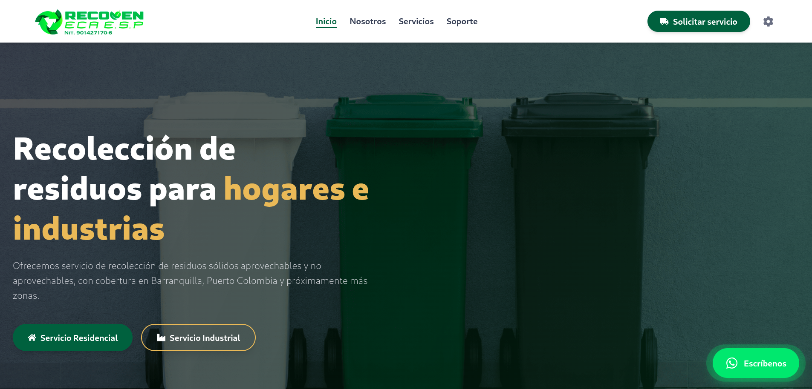

# ♻️ RECOVEN ECA SAS ESP — Plataforma Integral de Gestión Ambiental y Atención al Usuario

Plataforma web completa para la **Empresa de Servicios Públicos (ECA SAS ESP)** enfocada en economía circular, gestión sostenible de residuos y atención al ciudadano. El sistema integra una landing page institucional, un módulo público de PQRSDF, y un panel de administración robusto con autenticación multifactor.

🌐 **Landing Page:** [recovenesp.com](https://recovenesp.com)

---

## 📸 Vista Previa del Proyecto



---

## 🎯 Visión General y Objetivos

Esta plataforma ha sido diseñada para cumplir con los más altos estándares del sector de servicios públicos en Colombia, ofreciendo:

- **Identidad corporativa rigurosa** que transmite confianza, transparencia y compromiso ambiental.
- **Experiencia de usuario fluida y moderna**, accesible tanto para ciudadanos como para personal administrativo.
- **Cumplimiento normativo** con las leyes 142 de 1994, 1581 de 2012, 1755 de 2015 y la Resolución 2184 de 2019.
- **Gestión integral de PQRSDF** (Peticiones, Quejas, Reclamos, Sugerencias, Denuncias y Felicitaciones) alineada con los tiempos de respuesta establecidos por la ley.

---

## 🛠️ Tecnologías y Herramientas

### Frontend

| Tecnología                     | Uso                                                                |
| ------------------------------ | ------------------------------------------------------------------ |
| **React 18**                   | Biblioteca principal para la construcción de interfaces de usuario |
| **TypeScript**                 | Tipado estático y mejor mantenibilidad del código                  |
| **React Router v6**            | Enrutamiento SPA con rutas protegidas y navegación declarativa     |
| **Tailwind CSS**               | Sistema de diseño responsivo y utilidades CSS                      |
| **react-icons**                | Iconografía consistente con Font Awesome y Lucide                  |
| **Chart.js / react-chartjs-2** | Visualización de métricas operacionales                            |
| **Swiper**                     | Carruseles interactivos y responsivos                              |
| **date-fns**                   | Manipulación y formateo de fechas                                  |

### Backend y Servicios

| Tecnología           | Uso                                                                               |
| -------------------- | --------------------------------------------------------------------------------- |
| **NestJS** (Backend) | API RESTful para gestión de leads, métricas, certificados, autenticación y PQRSDF |
| **Supabase**         | Almacenamiento de archivos adjuntos (documentos, certificados)                    |
| **JWT**              | Autenticación segura con tokens de acceso y refresh                               |
| **2FA**              | Segundo factor de autenticación por correo electrónico                            |

### Infraestructura

- **Vite** como entorno de desarrollo y empaquetado.
- **Vercel** para despliegue continuo.
- **ESLint + Prettier** para calidad y formato del código.

---

## 🗂️ Estructura del Proyecto

```
src/
├── components/
│   ├── admin/              # Componentes del panel de administración
│   │   ├── LeadsTable.tsx
│   │   ├── MetricsManager.tsx
│   │   ├── DocumentsManager.tsx
│   │   ├── PqrsdfTable.tsx
│   │   └── PqrsdfDetailModal.tsx
│   ├── layout/             # Componentes estructurales
│   │   ├── Header.tsx
│   │   ├── Footer.tsx
│   │   └── WhatsAppButton.tsx
│   ├── public/             # Componentes de la interfaz pública
│   │   ├── ClientsCarousel.tsx
│   │   ├── ContactForm.tsx
│   │   ├── CTASection.tsx
│   │   ├── HeroCarouselServices.tsx
│   │   ├── StatisticsSection.tsx
│   │   ├── PqrsdfForm.tsx
│   │   ├── PqrsdfStatusChecker.tsx
│   │   └── PrivacyPolicyModal.tsx
│   └── ProtectedRoute.tsx   # Envoltura para rutas autenticadas
├── context/
│   ├── AuthContext.tsx      # Estado global de autenticación
│   └── PreselectContext.tsx # Estado para preselección de servicios
├── hooks/
│   ├── useAuth.ts
│   └── useServicePreselect.ts
├── pages/
│   ├── Home.tsx
│   ├── Empresa.tsx
│   ├── Servicios.tsx
│   ├── Login.tsx
│   ├── Dashboard.tsx
│   └── PqrsdfPage.tsx
├── services/
│   ├── api.ts              # Cliente HTTP con manejo de sesión
│   ├── auth.ts             # Autenticación (login, 2FA, logout)
│   ├── leads.ts            # Gestión de leads (público y admin)
│   ├── metrics.ts          # Métricas operacionales
│   ├── customers.ts        # Gestión de empresas/clientes
│   ├── certificates.ts     # Certificados y documentación
│   └── pqrsdf.ts           # PQRSDF (radicación, consulta, administración)
├── types/
│   ├── auth.ts
│   ├── lead.ts
│   ├── metric.ts
│   ├── customer.ts
│   ├── certificate.ts
│   └── pqrsdf.ts
├── constants/
│   └── navigation.ts
├── App.tsx
└── main.tsx
```

---

## 🚀 Características Principales

### 🏠 Landing Page Pública

- **Hero interactivo** con llamado a la acción para servicios residenciales e industriales.
- **Sección "Nuestra Empresa"** con misión, visión y certificaciones.
- **Tipos de servicio** con tarjetas que preseleccionan el formulario de contacto.
- **Carrusel de clientes** con arrastre suave y loop infinito (drag & swipe nativo).
- **Formulario de contacto** con preselección de servicio y especialidad mediante contexto global.
- **Estadísticas operacionales** con gráficas dinámicas (Chart.js) y descarga de reportes en PDF.
- **Sección de PQRSDF** con:
  - Marco legal (Leyes 142, 1755, 1581).
  - Formulario de radicación con carga de archivos adjuntos (FormData).
  - Consultor de estado con visualización de respuestas y descarga de documentos oficiales.
  - Política de privacidad en modal con contenido legal actualizado.

### 🔐 Panel de Administración

- **Autenticación de dos factores (2FA)** con envío de código por correo y cooldown de 60 segundos para reenvío.
- **Dashboard** con navegación lateral y cuatro módulos principales:

#### 1. Solicitudes (Leads)

- Visualización de leads registrados desde la landing page.
- Exportación a Excel con un clic.

#### 2. Actualizar Gráficas (Métricas)

- CRUD completo de métricas mensuales por sede (Barranquilla y Puerto Colombia).
- Filtro por año, edición y eliminación de registros.
- Actualización en tiempo real de las gráficas públicas.

#### 3. Envío de Certificados

- Gestión de empresas/clientes (creación, edición, eliminación).
- Carga de certificados (Word o PDF) con envío automático por correo al cliente.
- Historial de certificados despachados con vista previa del correo enviado.

#### 4. PQRSDF

- Tabla de auditoría con filtros por estado.
- Modal de gestión que permite:
  - Cambiar estado (Recibido, En trámite, Resuelto, Rechazado).
  - Redactar respuesta oficial.
  - Adjuntar documento de respuesta (PDF/imagen).
  - Notificación automática al usuario por correo.
- Visualización de archivos adjuntos del usuario y documentos de respuesta.

---

## ⚡ Decisiones Técnicas y Optimización

### 1. **Manejo de Autenticación y Sesión**

- **JWT** almacenado en `localStorage` con expiración de 30 minutos.
- **Evento `session-expired`** que escucha el contexto de autenticación para cerrar sesión automáticamente cuando el token expira.
- **Rutas protegidas** con `ProtectedRoute` que redirige al login si no hay token válido.

### 2. **Manejo de Archivos (FormData)**

- Tanto la radicación de PQRSDF como la respuesta del administrador usan `FormData` para enviar archivos adjuntos.
- El backend (NestJS) procesa los archivos y los sube a Supabase, retornando las URLs públicas.
- En la UI, se muestran enlaces de descarga tanto en la consulta pública como en el panel de administración.

### 3. **Preselección de Servicios con Contexto**

- El contexto `PreselectContext` permite guardar el tipo de servicio seleccionado desde el Hero, las tarjetas de servicios o el carrusel de la página de Servicios.
- Al navegar al formulario de contacto, el campo "Tipo de servicio" se preselecciona automáticamente.

### 4. **Scroll a Elementos con Hash**

- El componente `ScrollToHash` escucha cambios en la URL y hace scroll suave a los elementos con `id` (ej: `#contacto`, `#tipos-servicio`) sin recargar la página.

### 5. **Animaciones y Rendimiento**

- Animaciones `reveal` con `IntersectionObserver` para una carga progresiva.
- Carrusel de clientes con `requestAnimationFrame` y manipulación de `transform` para un rendimiento óptimo (INP < 10ms, CLS 0.05).

---

## 🔧 Instalación y Uso

### Requisitos previos

- Node.js v18 o superior
- npm o yarn

---

## 📦 Despliegue

El proyecto está configurado para despliegue continuo en **Hostinger**. Cada push a la rama `main` activa una nueva build y despliegue automático.

---

## 📄 Licencia y Propiedad Intelectual

Este repositorio es **público exclusivamente con fines de portafolio profesional y demostración técnica**.

El código fuente, diseño, arquitectura y componentes visuales pertenecen a **RECOVEN ECA ESP** y al desarrollador autor. **No se otorga ninguna licencia de uso, copia, modificación o distribución comercial o privada.** Para más detalles sobre las restricciones legales y términos de propiedad, por favor consulta el archivo [LICENSE](./LICENSE) adjunto en la raíz de este proyecto. Cualquier réplica no autorizada será notificada y procesada legalmente.

---

## 🤝 Contribuciones

Este proyecto es propiedad de RECOVEN ECA ESP. No se aceptan contribuciones externas sin autorización previa por escrito.

---
